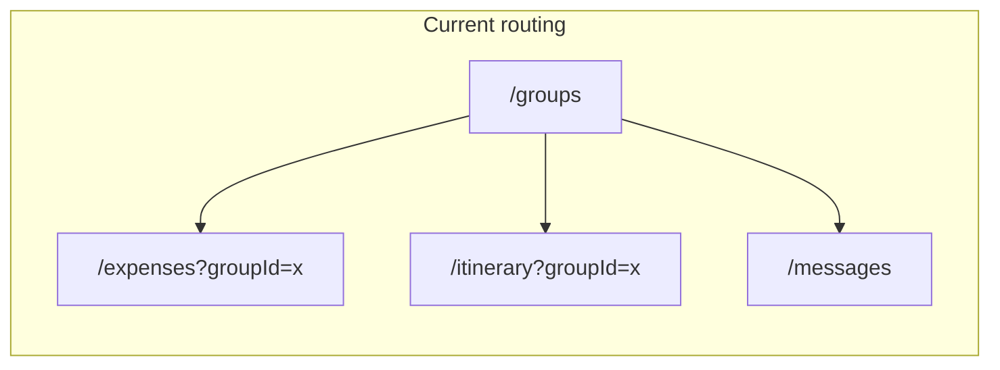
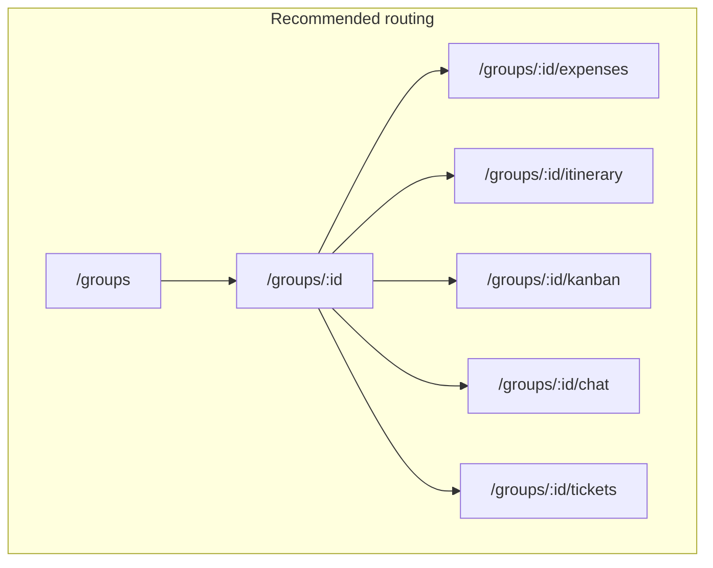

# Trip Connect — System Architecture Assessment (UI/UX Expert View)

This document evaluates whether the current system architecture satisfies production-grade UI/UX goals for Trip Connect (mobile-first, trip-centric, shareable, consistent) and what should be re-thought.

---

## 1. What Satisfies (Current Strengths)

### 1.1 Backend API structure

- **Nested trip resources**: API is already trip-centric:
  - `GET/POST /api/groups/:groupId/expenses`
  - `GET/POST /api/groups/:groupId/itineraries`
  - Groups and members: `/api/groups`, `/api/groups/:id`, `/api/groups/:id/members`
- **Single source of truth**: Trip is the natural container; backend enforces membership and scopes data by group.
- **Real-time**: Socket.io with `joinGroup(groupId)` so messaging and future live features (e.g. expense updates) can be scoped per trip.

**Verdict**: Backend architecture aligns with a “trip as container” mental model. No re-thinking needed here.

### 1.2 Auth and route protection

- **ProtectedRoute**: Ensures only authenticated users see app content; redirects to login with `state.from` for post-login return.
- **AdminRoute**: Contacts, Tags, Lists, and Users remain **admin-only** by design. Only ADMIN role can access these pages.
- **API layer**: Centralized auth (Bearer token in `api` interceptor), 401 → logout + redirect, 403 handled without noisy toasts.

**Verdict**: Auth and protection are coherent and production-appropriate.

### 1.3 Frontend foundation

- **Single Layout**: All protected pages use the same [Layout](frontend/src/components/Layout.tsx) (sidebar on desktop, hamburger on mobile). Consistent chrome and nav.
- **Design system**: [tokens](frontend/src/design-system/tokens.ts), ThemeProvider, shared UI components (Modal, Select, Combobox, GroupedList, ListRow, etc.) support consistency.
- **State**: Auth in React context; per-page local state for lists/forms. No unnecessary global state for trip context today.
- **Error and empty states**: DelightfulError and EmptyState used; network errors handled without generic toasts where appropriate.

**Verdict**: Foundation is solid for extending with new views and layout variants.

### 1.4 Data flow

- **API service**: Single axios instance, interceptors for auth and errors; services layer ([services/index.ts](frontend/src/services/index.ts)) exposes groupsAPI, expensesAPI, itinerariesAPI, etc., with `groupId` as first argument where needed.
- **No prop drilling**: Trip-scoped pages get `groupId` from URL (today: query string); no deep context chain.

**Verdict**: Data flow is clear. Moving `groupId` into the path (see §2.1) would improve URL-as-contract without changing this pattern.

---

## 2. What Needs Re-Thinking

### 2.1 Frontend routing: flat vs trip-centric URLs

**Current**:

- **Flat, feature-first routes**: `/groups`, `/expenses`, `/itinerary`, `/messages`.
- **Trip context via query**: Expenses and Itinerary use `useSearchParams()` and `groupId = searchParams.get('groupId')`. URLs look like `/expenses?groupId=abc`, `/itinerary?groupId=abc`.
- **No trip detail route**: There is no `/groups/:id`. The “trip” is a card on the Groups list with inline actions (Expenses, Itinerary). Messages uses in-page group picker + `selectedGroupId` in state (no URL for “current trip chat”).

**UX impact**:

- **Shareability / deep links**: `/expenses?groupId=abc` works but is brittle (query can be stripped, not semantic). “Share trip expenses” should be a stable URL.
- **Back button / history**: Navigating Group → Expenses → back often goes to Groups list, which is fine; but there is no single “trip shell” so the user never sees “Trip X” in the URL.
- **Product spec alignment**: Spec asks for trip-level Kanban, Calendar, Tickets, Chat, Expenses, Itinerary. Putting all of these under one trip URL (e.g. `/groups/:id/...`) makes the information architecture clear and allows one trip shell with sub-nav.

**Recommendation**: Re-think frontend routing to be **trip-centric**.

- Introduce **nested trip routes**:
  - `/groups` — list of trips (unchanged).
  - `/groups/:id` — trip overview or default tab (e.g. redirect to `/groups/:id/expenses` or show dashboard).
  - `/groups/:id/expenses`, `/groups/:id/itinerary`, `/groups/:id/kanban`, `/groups/:id/tickets`, `/groups/:id/chat` (or `/messages` with group in path).
- **Trip shell**: One shared component (e.g. TripShell) that:
  - Reads `id` from `useParams()`.
  - Fetches or caches trip name/details for header/breadcrumb.
  - Renders sub-navigation (tabs or horizontal nav) for Expenses, Itinerary, Kanban, Tickets, Chat.
- **Backward compatibility**: Redirect `/expenses?groupId=x` → `/groups/x/expenses`, `/itinerary?groupId=x` → `/groups/x/itinerary` so existing links and bookmarks still work.
- **Messages**: Either a dedicated “trip chat” at `/groups/:id/chat` (and optional global `/messages` that lists trips) or keep `/messages` but persist selected group in URL, e.g. `/messages?groupId=x` or `/messages/x`.

**Verdict**: Current routing does **not** fully satisfy a trip-first, shareable, deep-link-friendly UX. Re-thinking to nested trip routes + trip shell is recommended.

### 2.2 No dedicated trip context in the UI

**Current**:

- Trip-scoped pages get `groupId` from the URL (query today). There is no React context holding “current trip” (name, dates, etc.).
- Groups page holds list state; Messages holds `selectedGroupId` in local state.

**UX impact**:

- **Headers and breadcrumbs**: To show “Paris 2024 → Expenses” you’d need to fetch trip details on every trip-scoped page or pass them down. A lightweight TripContext (or trip from route + one fetch) would avoid duplicate requests and give a single place for trip name/date in the shell.
- **Offline / PWA**: Caching “current trip” for offline viewing is easier if there is a clear notion of “active trip” (e.g. from URL + cached trip entity).

**Recommendation**: Introduce a **lightweight trip context** (or a small hook like `useTripFromRoute()`) that:

- Reads `id` from the route (once you have `/groups/:id/...`).
- Fetches trip once (or from cache), exposes `{ trip, loading, error }`.
- TripShell and all trip-scoped pages use this so header/breadcrumb and optional offline cache stay consistent.

**Verdict**: Not blocking, but re-thinking to add a clear “trip from route” abstraction (context or hook) will scale better and support shell/offline.

### 2.3 Layout is one-size-fits-all

**Current**:

- Every protected page uses the same Layout (sidebar + main content). There is no BOARD or FOCUS layout variant from the unified UX spec.

**UX impact**:

- **Kanban**: A board benefits from full-width, minimal chrome (BOARD).
- **Calendar**: Same.
- **Smart info card**: When viewing one card full-screen, FOCUS (no sidebar) is better.
- **Notes list**: SYSTEM (with sidebar) is fine.

**Recommendation**: Already covered in the UI/UX spec plan — add layout variants (SYSTEM / BOARD / FOCUS) and pass layout ID from route or page. No re-thinking of overall architecture; just implementation.

**Verdict**: Satisfies once layout variants are implemented; no structural re-think.

### 2.4 Mobile: bottom bar vs sidebar

**Current**:

- Mobile uses the same sidebar, revealed via hamburger. No bottom navigation bar.

**UX impact**:

- Mobile-first spec and unified UX spec suggest a **bottom bar** on small screens (5–7 primary items) for thumb reach and clarity. Sidebar-on-mobile is acceptable but less ideal for frequent switching between People, Trips, Notes, Calendar.

**Recommendation**: Already in the UI/UX spec — add a BottomNav on mobile and hide or simplify sidebar on small viewports. No backend re-think.

**Verdict**: Satisfies once bottom bar is implemented; no architectural change.

---

## 3. Product / Role Model Clarifications

### 3.1 Trip-centric vs feature-centric navigation

- **Current**: User goes to “Groups” → picks a group → clicks “Expenses” or “Itinerary” and leaves the Groups page. Mentally: “I’m on the Expenses screen for this trip.”
- **Spec**: Trip as container with messaging, participants, expenses, itinerary, Kanban, tickets. Mentally: “I’m inside Trip X; now I’m looking at Expenses.”

Re-thinking routing and adding a trip shell (§2.1, §2.2) aligns the **information architecture** with the spec and satisfies an UI/UX expert view of “trip-first.”

### 3.2 Admin-only: Contacts, Tags, Lists, Users (retained)

- **Decision**: **Retain admin-only** for Contacts, Tags, Lists, and Users. [AdminRoute](frontend/src/components/AdminRoute.tsx) continues to wrap these pages; only ADMIN role can access them.
- No change to route protection for these surfaces.

---

## 4. Summary: Satisfied or Re-Thinking?

| Area | Satisfies? | Action |
|------|------------|--------|
| Backend API (nested trip resources) | Yes | Keep as-is. |
| Auth and route protection | Yes | Keep; Contacts, Tags, Lists, Users remain admin-only. |
| Design system and shared UI | Yes | Keep; add layout variants and bottom bar per UI/UX spec. |
| Data flow and API layer | Yes | Keep; optional TripContext/hook once trip is in the path. |
| **Frontend routing (trip in URL)** | **No** | **Re-think**: adopt nested routes `/groups/:id/...` and a trip shell. |
| **Trip context (header, breadcrumb, offline)** | **Partial** | **Re-think**: add TripContext or `useTripFromRoute()` when moving to nested routes. |
| Layout variants (BOARD, FOCUS) | Not yet | Implement per plan; no re-think. |
| Mobile bottom bar | Not yet | Implement per plan; no re-think. |

**Overall**: The **backend and auth/data foundation satisfy** a UI/UX expert. The **frontend routing and lack of a trip shell do not** fully satisfy a mobile-first, trip-centric, shareable UX. Re-thinking should focus on:

1. **Nested trip routes** and a **trip shell** with sub-nav.
2. **Lightweight trip context** (or hook) keyed by route.
3. **Admin-only retained** for Contacts, Tags, Lists, and Users (no change).

Implementing these will align the system architecture with the intended UX and make future features (Kanban, Calendar, Tickets, smart cards) sit naturally under one trip URL and one shell.

---

## 5. Diagram view of routing

### Current (flat, query-based)

Trip context is in the query string; there is no trip shell. User goes to Groups, then jumps to Expenses/Itinerary with `?groupId=x`.

**Flowchart:**

```
                    +----------+
                    | /groups  |
                    +----+-----+
                         |
         +---------------+---------------+
         |               |               |
         v               v               v
  +--------------+ +--------------+ +------------------+
  | /expenses    | | /itinerary   | | /messages        |
  | ?groupId=x   | | ?groupId=x   | | (group picker    |
  +--------------+ +--------------+ +------------------+  in page)
```

**Mermaid** (if your viewer supports it):



---

### Recommended (nested, trip-centric)

Trip is in the path; one trip shell with sub-nav. User goes to a trip, then switches tabs within the trip.

**Flowchart:**

```
  +----------+      +------------------+
  | /groups  | ---> | /groups/:id      |
  +----------+      | (trip overview)  |
                    +--------+---------+
                             |
     +--------+--------+-----+-----+--------+
     |        |        |           |        |
     v        v        v           v        v
  +-------+ +-------+ +-------+ +-------+ +--------+
  |expenses| |itinerary| |kanban | | chat  | |tickets |
  +-------+ +-------+ +-------+ +-------+ +--------+
     (all under /groups/:id/...)
```

**Mermaid** (if your viewer supports it):


